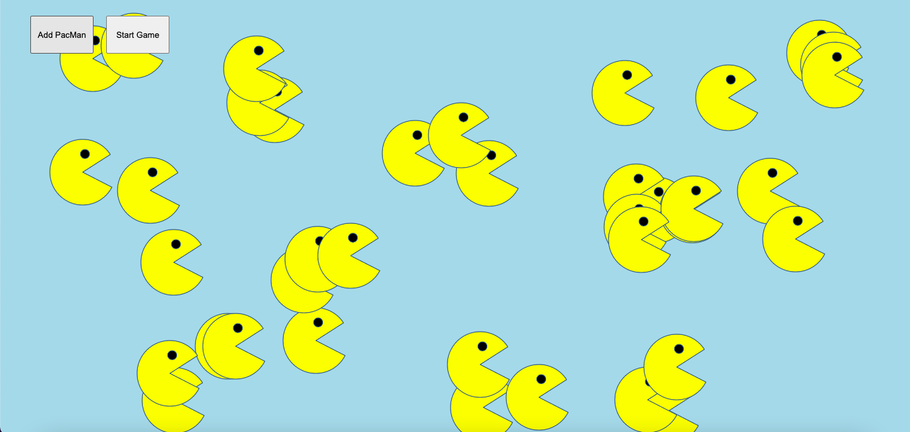

# PacMen Exercise

## Description of Project
This project is a fun and interactive web application that creates PacMen at random positions on the screen. These PacMen can bounce around the screen at random velocities.

## How to Run
1. Clone this repository to your local machine.
2. Open the `index.html` file in your preferred web browser.
3. Click the "Make One" button to create a new PacMan.
4. Watch as the PacMen bounce around the screen!

## Roadmap of Future Improvements
Plans for future updates include adding user controls for the direction and speed of the PacMen.

## License Information
This project is licensed under the MIT license. For more information, please refer to the MIT [license](./LICENSE) documentation.

## Screenshot

